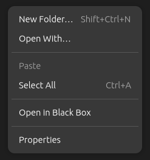

# Nautilus Black Box

This is a Nautilus extension that adds an option to open a Black Box terminal within Nautilus. With this extension, you can quickly open a terminal window in the current directory by right-clicking on a folder or file and selecting "Open in Black Box Terminal" from the context menu.  

</img>

## Installation

To install Nautilus Black Box, you will need to have the following packages installed on your system:
 - meson
 - python3
 - nautilus-python

Once you have these dependencies installed, follow these steps to build and install the extension:

```bash
git clone https://github.com/awumii/nautilus-blackbox.git
cd nautilus-blackbox
meson setup builddir
sudo ninja -C builddir install
```

Restart Nautilus:

```bash
nautilus -q
```
This will restart Nautilus with the new extension loaded. You should now see a new option in the context menu when you right-click on a folder or file in Nautilus.

## Usage

To use Nautilus Black Box, simply right-click on a folder or file in Nautilus and select "Open in Black Box Terminal" from the context menu. This will open a new Black Box terminal window in the current directory.

## Uninstallation

To uninstall Nautilus Black Box, simply run the following command:

```bash
sudo ninja -C build uninstall
```

This will remove the extension from your system. You may also want to restart Nautilus afterwards to ensure that the extension is fully unloaded:

```bash
nautilus -q
```
